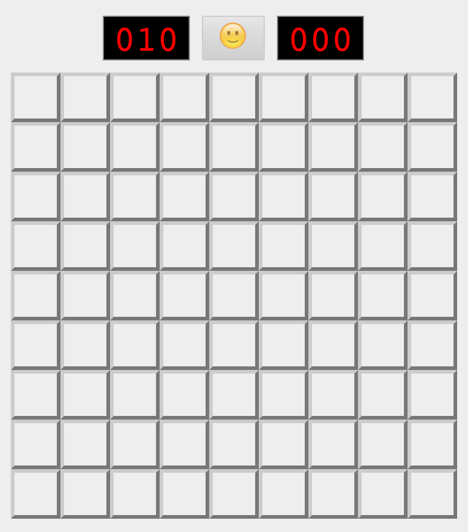
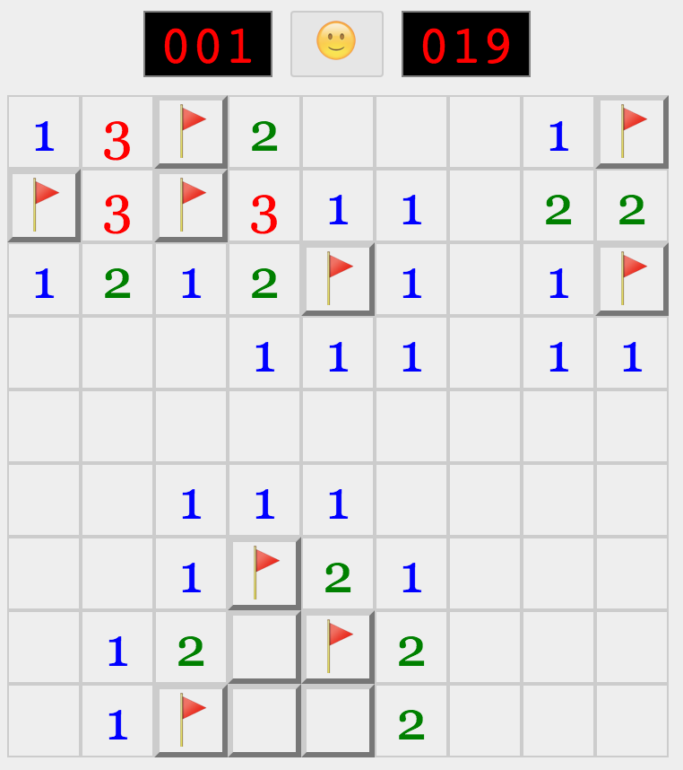
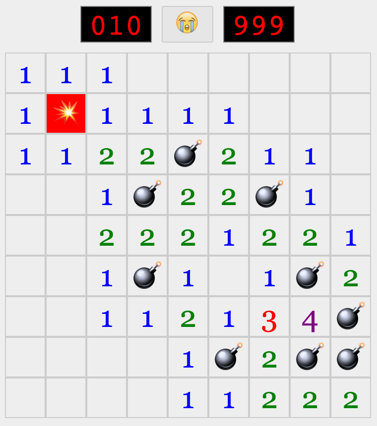
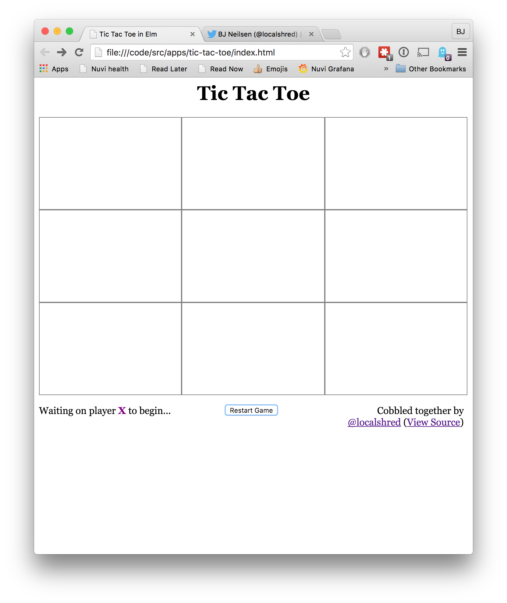
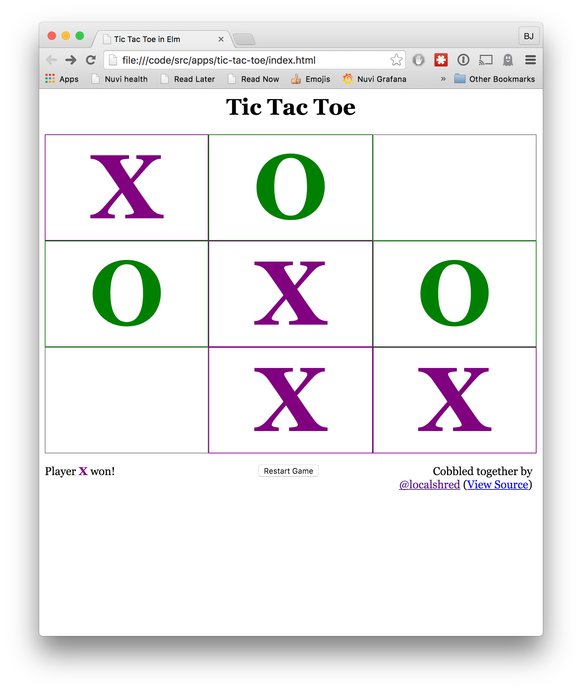
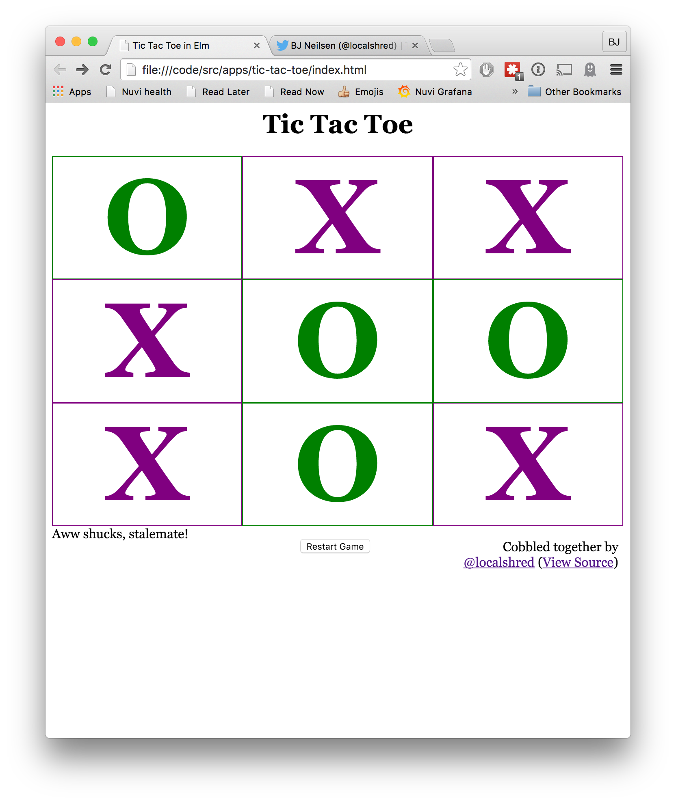

# Elm Games

I'm learning Elm so I thought I'd create a bunch of random little games.

The list so far:

+ [Minesweeper](https://localshred.github.io/elm-games/)
+ [TicTacToe](https://localshred.github.io/elm-games/)

Other games I may write:

+ Tetris
+ Sudoku
+ Memory

-----

### Screenshots

New Game

Progress

Win

Loss

#### TicTacToe

Pending game

X Wins

Stalemate

